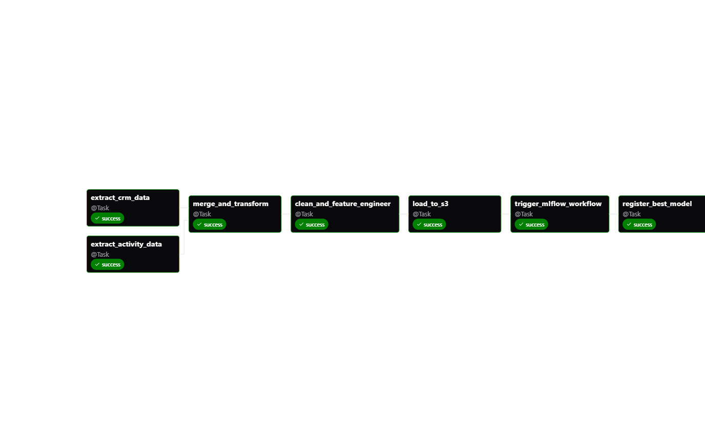

# Customer Churn Prediction Pipeline

This project implements an end-to-end machine learning pipeline for predicting customer churn using Apache Airflow, MLflow, and AWS services. The pipeline processes customer data and activity logs to build and deploy a machine learning model that predicts customer churn probability.

## Architecture
.jpg)

The pipeline consists of several components:
- Data ingestion from AWS RDS (CRM data) and S3 (activity logs)
- Data preprocessing and feature engineering
- Model training and evaluation using MLflow
- Model versioning and deployment
- Performance monitoring and logging

## Project Structure

```
.
├── airflow_settings.yaml     # Local Airflow configurations
├── architecture_diagram.drawio  # Pipeline architecture diagram
├── Dockerfile               # Airflow runtime configuration
├── packages.txt            # System-level dependencies
├── requirements.txt        # Python package dependencies
├── README.md              # Project documentation
├── dags/                  # Airflow DAG definitions
│   ├── crm_activity_mlflow_pipeline.py  # Main pipeline DAG
│   ├── exampledag.py     # Example DAG
│   └── openweather.py    # Weather data DAG
├── data/                  # Data directory
│   ├── processed_data.csv
│   ├── crm_data/         # Customer data
│   │   ├── crm_data_1.csv
│   │   ├── crm_data_2.csv
│   │   └── crm_data_3.csv
│   └── logs/             # Activity logs
│       ├── activity_data_1.csv
│       ├── activity_data_2.csv
│       └── activity_data_3.csv
├── include/              # Additional resources
├── mlartifacts/         # MLflow model artifacts
├── mlruns/              # MLflow experiment tracking
├── plugins/             # Airflow plugins
├── scripts/             # Utility scripts
│   ├── data_view.ipynb  # Data analysis notebook
│   ├── generate_activity_data.py
│   ├── generate_crm_data.py
│   ├── load_crm_to_rds.py
│   └── ml_app.py       # ML application script
└── tests/              # Test files
    └── dags/          # DAG tests
        └── test_dag_example.py

Key Components:
1. Data Pipeline (dags/):
   - Customer data ingestion
   - Activity log processing
   - Feature engineering
   - Model training workflow

2. Data Management (data/):
   - CRM data storage
   - Activity logs
   - Processed datasets

3. Machine Learning (mlartifacts/, mlruns/):
   - Model artifacts
   - Experiment tracking
   - Performance metrics

4. Development Tools (scripts/):
   - Data generation utilities
   - Loading scripts
   - Analysis notebooks

## Prerequisites

- Python 3.12+
- Docker Desktop
- AWS Account with access to:
  - RDS (MySQL database)
  - S3 buckets
- MLflow server
- Astro CLI (Astronomer's Airflow distribution)

## Environment Setup

1. Clone the repository:
```bash
git clone https://github.com/Amoako419/Customer_Churn_Prediction_Pipeline.git
cd Customer_Churn_Prediction_Pipeline
```

2. Create and configure environment variables (.env file):
```env
# AWS Credentials
AWS_ACCESS_KEY_ID=your_access_key
AWS_SECRET_ACCESS_KEY=your_secret_key
AWS_REGION=your_region

# Database Connection
RDS_CONNECTION_ID=rds_conn
DB_HOST=your_db_host
DB_PORT=3306
DB_USER=your_db_user
DB_PASSWORD=your_db_password
DB_NAME=your_db_name

# S3 Bucket Information
ACTIVITY_BUCKET_NAME=your_activity_bucket
ACTIVITY_FILE_KEY=activity-data/
PROCESSED_DATA_BUCKET_NAME=your_processed_data_bucket

# MLflow Configuration
MLFLOW_TRACKING_URI=http://host.docker.internal:5000
MLFLOW_EXPERIMENT_NAME=crm_activity_model
MLFLOW_MODEL_NAME=crm_activity_classifier
```

3. Install dependencies:
```bash
pip install -r requirements.txt
```

## Testing

### Local Testing

1. Run Astro tests:
```bash
astro dev test tests
```

2. Run pytest:
```bash
pytest tests/
```

### Continuous Integration

The project uses GitHub Actions for CI/CD. On every push and pull request:
- DAGs are parsed for syntax errors
- Unit tests are run
- Integration tests are executed
- Code quality checks are performed

View test results in the GitHub Actions tab of the repository.

## Running the Pipeline

1. Start the MLflow tracking server:
```bash
mlflow server --host 0.0.0.0 --port 5000
```

2. Start Airflow using Astro CLI:
```bash
astro dev start
```

This command will spin up the Airflow components:
- Postgres: Metadata Database
- Scheduler: Task monitoring and triggering
- Webserver: UI and API access
- Triggerer: Managing task execution

3. Access the Airflow UI:
- Open http://localhost:8080 in your browser
- Default credentials: airflow/airflow

4. Set up Airflow Connections:
- Navigate to Admin -> Connections
- Add AWS connection
- Add RDS connection
- Verify MLflow connection

5. Trigger the Pipeline:
- Navigate to DAGs view
- Locate 'crm_activity_mlflow_pipeline'
- Click "Trigger DAG"

## Monitor the pipeline execution:
- Check task status in the Airflow UI
- View logs for each task
- Monitor MLflow for model training and evaluation




## Features

1. Data Processing:
- Automated data ingestion from multiple sources
- Robust feature engineering
- Data quality validation
- Efficient data transformation

2. Model Training:
- RandomForestClassifier with optimized parameters
- Cross-validation and performance metrics
- MLflow experiment tracking
- Model versioning and staging

3. Monitoring:
- Comprehensive logging
- Performance metrics tracking
- Error handling and retries
- Pipeline status monitoring

## Troubleshooting

1. MLflow Issues:
- Ensure MLflow server is running
- Check MLFLOW_TRACKING_URI
- Verify Docker network connectivity

2. AWS Connectivity:
- Verify credentials in .env
- Check S3 bucket permissions
- Validate RDS connection

3. Pipeline Errors:
- Check Airflow task logs
- Verify data schemas
- Monitor resource usage

## Contact

For support or contributions:
- GitHub: @Amoako419
- Report issues on the GitHub repository
